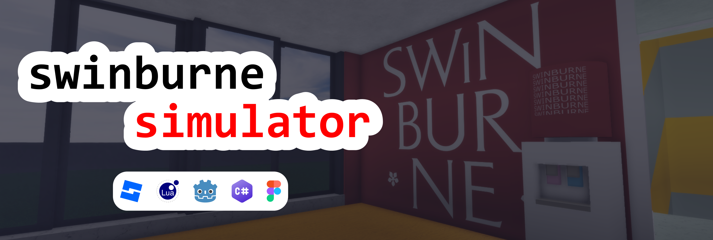

# Swinburne Simulator

## Project Idea

We make a video game that provides you a virtual tour at the A35 building of the Swinburne University campus in Ho Chi Minh city, Vietnam. The objective is to showcase the campus amenities to everyone interested (e.g. potential students, parents, businesses)

## Project Implementation

### The Roblox way (current)

- Deployment: <https://roblox.com/games/1437186416>
- Source code: [impl-roblox](../impl-roblox/)
- Level design: Roblox Studio
- Development: Lua (Luau)
- Asset design: Inkscape

### The Threlte way (discontinued)

- Source code: [impl-threlte](../impl-threlte/)
- Level design: Three.js
- Development: Svelte, Threlte

### The Godot way (discontinued)

- Source code: [impl-godot](../impl-godot/)
- Level design: Godot Mono
- Development: C#
- Asset design: Figma (yes I really used Figma to do tilesets)

## Stakeholders

+ student Minh-Triet (Turito Yuenan)
	- Author and primary contributor
+ student Bao-Ngoc (hann)
	- Design support in Godot Impl
+ student Ngoc-Anh (Na)
	- Design support in Godot Impl
+ student Vinh-Khang (katiue)
	- Idea & early version support
+ Ms. Titan Vo
	- Supervisor from April - September
+ Mr. Duy Nguyen
	- Supervisor from October
